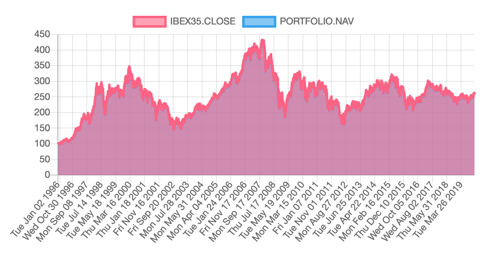
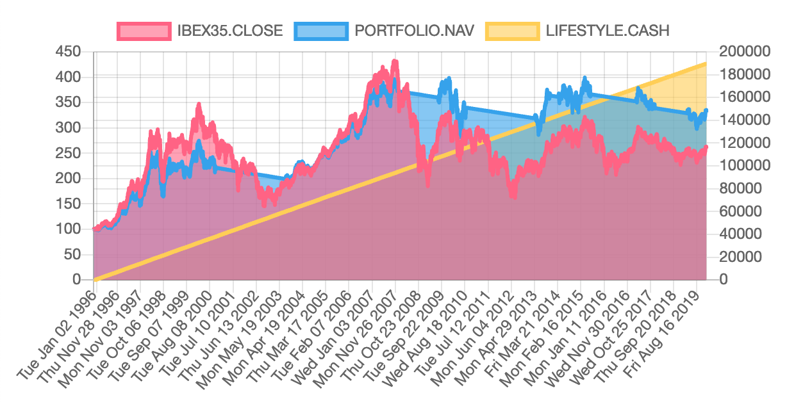
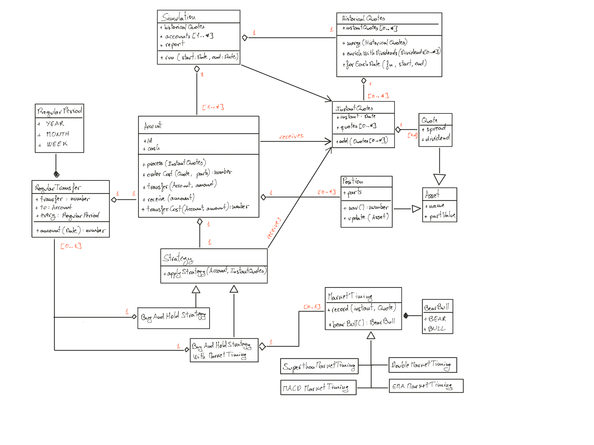

# Angular Backtest

A library to backtest investment strategies addressing the particular needs
of the private, non professional investor.

## Introduction

### What is it for?

Backtesting is a term used in modelling to refer to testing a predictive model
on historical data. Backtesting is a type of retrodiction, and a special type
of cross-validation applied to previous time period(s).
(see https://en.wikipedia.org/wiki/Backtesting).

In layman terms, backtesting consists in devising some kind of investment
strategy, download historical data relevant to the strategy, and see how it
would have performed in the past.

The most used tool for backtesting is Excel. While it does wonders to verify
the initial idea of the strategy, you soon stumble over the complexities of an
investment system - the order costs, the custody costs, the currency exchange,
the taxes... Plus, you would need to write your strategy in VBA, which is not
of the taste of everyone.

### Who is it for?
This project is for anyone seeking FIRE: Financial Independence
Retire Early, as it addresses some of the issues common to these individuals:
* They're private individuals, so trade operations have a significant cost that
  may impact their level of financial independence.
* They may live in a foreign country, so currency exchange rates have a significant
  impact on their level of financial independence.
* They're non qualified, non professional investors, so they don't have
  access to all investment products.
* They're exposed to a life-threatening risk if their investment fail, as they
  may loose their financial independence.

More generally, this project is for anyone who wonders if the strategies
described in all those youtube channels are as wonderful they look,
and if they're feasible in practical life.

Oh, and also, to use this project you need some knowledge of programming
language. Not a lot, but some. Because you need to configure your strategy,
download the financial data, and make it work.

### Beware of over fit
Besides having bugs in the calculation, the most immediate danger of backtesting
is called overfitting.

In statistics, overfitting is _the production of an analysis that corresponds
too closely or exactly to a particular set of data, and may therefore fail to
fit additional data or predict future observations reliably_
(see https://en.wikipedia.org/wiki/Overfitting)

When they show you documentation about an investment instrument at the bank, you
often can see, in small letters, a statement saying _Past Performance Is No
Guarantee of Future Results_, it is also a warning against overfitting.

Imagine that you spot some instrument A you want to invest into, and you discover
that some other instrument B tends to rise a couple of months before. Astutely, you
set up a strategy where you buy shares of A as soon as you detect a raise in B. You
backtest this strategy, and it does wonders. Jackpot! Or is it? The fact that
B is correlated to A may be consequence of a thousand factors, and they may change
just because economy evolves.

## How to use the library

Here is an simple example on how to run a simulation based on an hypothetic
passive ETF that follows the IBEX-35 index.

### Find the historical quotes

The first step is finding the financial data to execute the simulation. Look in
project folder ``src/app/services/quotes`` for the list of compatible sources:
- _finance.yahoo.com_ - CSV files downloaded from https://finance.yahoo.com
- _www.six-group.com_ - JSON files downloaded from https://www.six-group.com/exchanges/shares/overview_en.html

_Yahoo Finance_ provides the IBEX-35 in https://finance.yahoo.com/quote/%5EIBEX.
Click on _Historical Data_ and select the following options:
- _Time Period_: Max
- _Show_: Historical Prices
- _Frequency_: Daily

Then click on _Apply_ and _Download_ the data. You should obtain a CSV file.

As a side note, the index itself is not a passive ETF. In initial stages
it is acceptable to simulate using the index as if it were your fund.
Later on, you need to find your actual fund, and see important details
like TER, liquidity, buying and selling costs etc.

### Include the historical quotes in the project
Copy that file in project folder ``src/assets/quotes/indexes`` (you could
save it in a different folder, as long as you provide the correct path in
the next step).

Give it an appropriate name, like ``ibex35-yahoo.csv``.

To make it available, you must edit ``src/assets/quotes/configuration.json``, and
add an entry similar to the following:
```
{
  "name": "IBEX-35",
  "source": "indexes/ibex35-yahoo.csv",
  "provider": "finance.yahoo.com"
},
```

### Make a simulation with your data
To configure the simulation, open the component ``src/app/simulation/simulation.component.ts``,
and look at the code. There are three distinct parts:

Even if it is not the first part, let's have a look at the simulation set up. This
example simulates:
- A ``SwissQuoteAccount``, we will name it ``PORTFOLIO``, as it represents
  exactly this, our portfolio.
- Initially it contains 100'000 in cash.
- We're going to apply a B&H strategy (see https://www.investopedia.com/terms/b/buyandhold.asp), which consists in investing all cash into one asset.
- Our asset of choice is the IBEX35.
- And we're going to report the results to this ``ng2ChartReport``.

Here is the code snippet:

```
this.simulation = new Simulation({
  accounts: [
    new SwissQuoteAccount({
      id: "PORTFOLIO",
      cash: 100000,
      strategy: new BuyAndHoldStrategyWithTiming({
        assetName: "IBEX35",
      })
    }),
  ],
  historicalQuotes: historicalQuotes,
  report: this.ng2ChartReport
});
```

Next is to check the reporting component, ``ng2ChartReport``. In this example,
- ``Shows`` The daily closing quote for the ``IBEX35`` as a ``LINE`` referred
to the ``LEFT`` axis.
- ``Shows`` The daily NAV of our ``PORTFOLIO`` account, as a ``LINE`` referred
to the ``LEFT`` axis.
- Mind the ``normalize`` flag that is set to ``true``: it means that the
concerned values are divided by a factor so they start the chart at 100.

```
this.ng2ChartReport = new Ng2ChartReport([
  {
    show: "IBEX35.CLOSE",
    as: ShowDataAs.LINE,
    on: ShowDataOn.LEFT,
    normalize: true
  },
  {
    show: "PORTFOLIO.NAV",
    as: ShowDataAs.LINE,
    on: ShowDataOn.LEFT,
    normalize: true
  }
]);
```

Finally, running the simulation is executed in one single line containing the
start date and the end date:

```
this.simulation
  .run(new Date(1996, 0, 0), new Date (2020, 0, 1));
```

Unsurprisingly, your portfolio's NAV is following the IBEX35 index. It is so
close that you can't actually see the blue line:



### A second simulation with your data
Although IBEX35 seems grim, I believe it provides a good sanity check to
confront your investment strategy to bad time. Also, Spain is one of the top 20
economies in the world, so this could also happen to your chosen index.

Let's see some additions to the B&H strategy:
- We could use some sort of timing. Market timing considers the recent past
and tells you when to enter or exit the market.
- If this is a retirement fund, we should be retiring some money
from it, because we need to live.

Below is the new snippet for the simulation. You can probably spot where
we use the _Superthon_ as a market timing. Also, see how we transfer 660
in cash every month (that would be a yearly 8%) to a second account
identified by ``LIFESTYLE`` :

```
this.simulation = new Simulation({
  accounts: [
    new SwissQuoteAccount({
      id: "PORTFOLIO",
      cash: 100000,
      strategy: new BuyAndHoldStrategyWithTiming({
        assetName: "IBEX35",
        marketTiming: new SuperthonMarketTiming(),
        transfer: new RegularTransfer({
          transfer: 660,
          every: RegularPeriod.MONTH,
          to: new SwissQuoteAccount({
            id: "LIFESTYLE"
          })
        })
      })
    }),
  ],
  historicalQuotes: historicalQuotes,
  report: this.ng2ChartReport
});
```

To see the cash transfers, we need to add it to the report. This time we
refer it to the right axis, and not normalize it:

```
this.ng2ChartReport = new Ng2ChartReport([
  ...
  ...
  {
    show: "LIFESTYLE.CASH",
    as: ShowDataAs.LINE,
    on: ShowDataOn.RIGHT
  }
]);
```
At the beginning, the NAV is lower than the index because of the transfers of
660 we execute every month. Then market timing saves us from the worst, and we
sell all our positions in 2000, 2007, 2010, and a couple of other times that we
could have skipped but seemed dangerous at the time. While we are out of the
market, the NAV becomes a straight decreasing line because of the regular
transfers that we keep doing. In the end, we managed to increase 3 fold the
value of our portfolio, plus extracting nearly 190'000 in cash along this
whole period.



It looks really nice. If you want to scare yourself try starting the
simulation in 2006.

### Understand what's happening
Angular is not a difficult language, and you don't need to master it to go further.
Nonetheless, you will need to make some effort. Start by investing some time in
learning the very basics of the language.

- Follow one of those crash courses in internet.
- Follow the _tour_of_heroes_ official tutorial.

Now that you understand the very basics of the language, you can follow how the ``simulation``
component works:

## Code structure



## Running the application

To install and run this project, you need _Git_, _Node.js_ and _npm_:
* _Git_ is a distributed version-control system for tracking changes in source code during software development. It is designed for coordinating work among programmers, but it can be used to track changes in any set of files (see https://en.wikipedia.org/wiki/Git). You will use to retrieve sources from _GitHub_ and copy them on your machine.
* _Node.js_ is an open-source, cross-platform, JavaScript library that executes JavaScript code outside of a browser (see https://en.wikipedia.org/wiki/Node.js).
* _npm_, originally short for _Node Package Manager_, is a package manager for the JavaScript programming language. It is the default package manager for the JavaScript runtime environment _Node.js._ (see https://en.wikipedia.org/wiki/Npm_(software) ) and it is shipped with it.

### In Windows
Download and install the required tools from the official sites:

* Git: https://git-scm.com/download/win
* Node.js: https://nodejs.org/en/download/

After installation, open a comand prompt (click on start, and then type ``cmd`` and ``[ENTER]``) and verify that all three tools are there:

```
git --version
node --version
npm --version
```

Later on, to update _Node.js_, simply reinstall it from the same source.

### Compile and run the program (all platforms)
Look for or create an appropriate folder where to install the project, then open the command prompt, navigate to it, and use _Git_ to clone the sources:

```
cd Documents
git clone https://github.com/jean-michel-gonet/angular-backtest.git
cd angular-backtest
npm install
npm start
```

When the compilation is finshed, you should see an indication that the program is running and available as a local web site:

```
...
...
Angular Live Development Server is listening on localhost:4200, open
your browser on http://localhost:4200/
```

Open a browser on that address, and you should see the main page.

## Troubleshooting

Those are some common errors you may stumble upon when you start using this
project.

### ERROR in securities-configuration.json

When launching the application: ``npm start``:
```
ERROR in ./src/assets/securities/securities-configuration.json
Module parse failed: Unexpected token } in JSON at position 321 while parsing near...,
...
You may need an appropriate loader to handle this file type
```

This is usually a syntax error in the securities configuration file, which
is located at ``securities-configuration.json``.

Best strategy, if you can't spot the error, is to copy the content of the file
into some online JSON validator (like https://jsonlint.com/?code=) and let it
find the error for you.

## Documentation I used to write the code:

This is some of my reference documentation:

- https://www.positronx.io/angular-chart-js-tutorial-with-ng2-charts-examples/
- This project was generated with [Angular CLI](https://github.com/angular/angular-cli) version 8.3.9.
- Historical dividends for S&P500 index: https://www.multpl.com/s-p-500-dividend-yield/table/by-year
- How to calculate MACD. Also, contains this piece of advice:
  _It’s important to remember that an indicator showing good entries rarely shows good exits_
  : https://www.iexplain.org/calculate-macd/
- How to calculate Moving averages, and EMA in particular: https://en.wikipedia.org/wiki/Moving_average
- https://www.liberatedstocktrader.com/top-10-rules-for-using-stock-chart-indicators-effectively/
